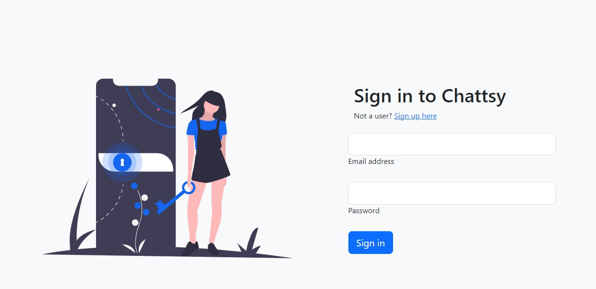
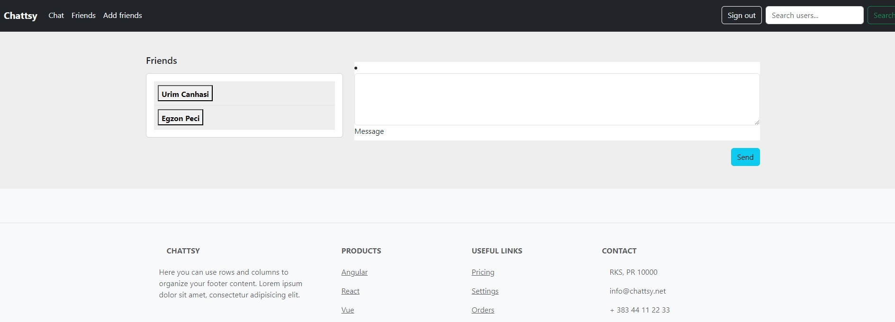

# Chattsy

Welcome to Chattsy, a real-time chat room application built with Laravel, React, and MySQL.Laravel Sanctum, Pusher and pusher-js were utilized also for this app

## Table of Contents
- [Introduction](#introduction)
- [Features](#features)
- [Technologies Used](#technologies-used)
- [Installation](#installation)
- [Usage](#usage)
- [Contributing](#contributing)
- [License](#license)

## Introduction
Chattsy is a dynamic chat room application designed to provide users with a seamless and interactive chatting experience. Leveraging Laravel for the backend, React for the frontend, and MySQL for data storage, Chattsy aims to be a versatile solution for real-time communication.

## Features
- 🛡 **Secure Authentication:** Utilizing Laravel Sanctum for robust user authentication.
- 💬 **Real-Time Updates:** Powered by Laravel Pusher for dynamic and instant chat updates.
- 🌐 **Dynamic Chat Rooms:** Create, join, and engage in various chat rooms.
- 🔄 **User-Friendly Interface:** A sleek and intuitive UI for a seamless user experience.
- ⚙️ **Scalable and Open-Source:** Built with scalability in mind and open-source for community collaboration.

## Technologies Used
- [Laravel](https://laravel.com/)
- [React](https://reactjs.org/)
- [MySQL](https://www.mysql.com/)
- [Laravel Sanctum](https://laravel.com/docs/8.x/sanctum)
- [Laravel Pusher](https://pusher.com/docs/channels)
- [pusher-js]

> [!TIP]
> ## Installation
> 1. Clone the repository: `git clone https://github.com/your-username/chatsy.git`
> 2. Navigate to the project folder: `cd chatsy`
> 3. Install dependencies for Laravel: `composer install`
> 4. Install dependencies for React: `npm install`
> 5. Set up your database and update the `.env` file with the necessary configurations.
> 6. Run migrations: `php artisan migrate`
> 7. Start the development server: `php artisan serve` for Laravel and `npm start` for React.

## Usage
1. Register or log in to explore the chat rooms.
2. Create your own chat room or join existing ones.
3. Engage in real-time conversations with other users.

## Contributing
Contributions are welcome! Please follow our [contribution guidelines](CONTRIBUTING.md) for details.

## License
This project is licensed under the [MIT License](LICENSE).

Feel free to explore, contribute, and share your thoughts on Chatsy! 🚀💬
